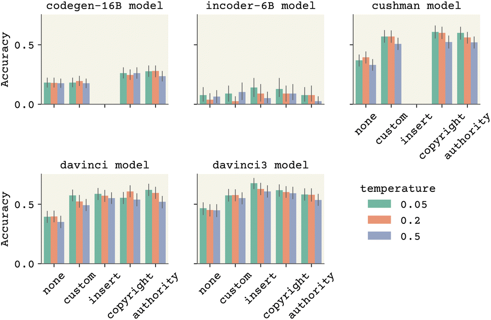
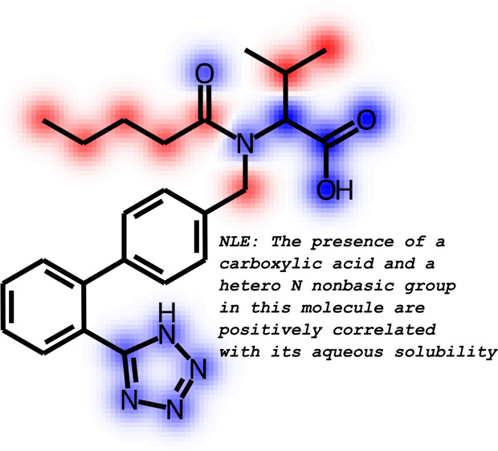
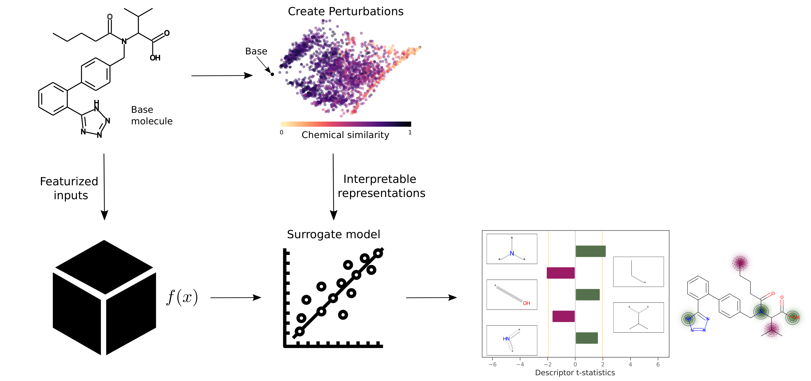

White, A. D., Hocky, G. M., **Gandhi, H. A.**,Ansari, M., Cox, S., Wellawatte, G. P., Sasmal, S., Yang, Y.,  Liu, K., Singh, Y. and Peña Ccoa, W. J. [Assessment of chemistry knowledge in large language models that generate code](https://pubs.rsc.org/en/content/articlehtml/2023/dd/d2dd00087c) *Digital Discovery*, 2, 368-376 (**2023**).\

Wellawatte, G. P., **Gandhi, H. A.** & White, A. D. [A Perspective on Explanations of Molecular Prediction Models](https://pubs.acs.org/doi/full/10.1021/acs.jctc.2c01235). *Journal of Chemical Theory and Computation*, 19, 8, 2149-2160 (**2023**).\

**Gandhi, H. A.** & White, A. D. [Explaining structure-activity relationships using locally faithful surrogate models](https://chemrxiv.org/engage/chemrxiv/article-details/633731d1f764e6e535093041). *ChemRxiv* (**2022**).\

**Gandhi, H. A.\***, Ansari, M.\*, Foster, D. G. & White, A. D. [Iterative symbolic regression for learning transport equations](https://aiche.onlinelibrary.wiley.com/doi/abs/10.1002/aic.17695). *AIChE Journal*, e17695 (**2022**).\

**Gandhi, H. A.** & White, A. D. [City-wide modeling of vehicle-to-grid economics to understand effects of battery performance](https://doi.org/10.1021/acssuschemeng.1c05490). *ACS Sustainable Chemistry and Engineering* 9, 44, 14975–14985 (**2021**).\

**Gandhi, H. A.**, Jakymiw, S., Barrett, R., Mahaseth, H. & White, A. D. [Real-time interactive simulation and visualization of organic molecules](https://pubs.acs.org/doi/abs/10.1021/acs.jchemed.9b01161). *Journal of Chemical Education* 97, 11, 4189–4195(**2020**).\

Barrett, R., Chakraborty, M., Amirkulova, D., **Gandhi, H. A.**, Wellawatte, G. & White, A. [Hoomd-tf: GPU-accelerated, online machine learning in the hoomd-blue molecular dynamics engine](https://doi.org/10.21105/joss.02367). *Journal of Open Source Software* 5, (**2020**).\

Li, Z., Wellawatte, G. P., Chakraborty, M., **Gandhi, H. A.**, Xu, C. & White, A. D. [Graph neural network based coarse-grained mapping prediction](https://pubs.rsc.org/en/content/articlehtml/2020/sc/d0sc02458a). *Chemical Science* 11, 9524–9531 (**2020**).\

Barrett, R., **Gandhi, H. A.**, Naganathan, A., Daniels, D., Zhang, Y., Onwunaka, C., Luehmann, A. & White, A. D. [Social and tactile mixed reality increases student engagement in undergraduate lab activities](https://pubs.acs.org/doi/abs/10.1021/acs.jchemed.8b00212). *Journal of Chemical Education* 95, 1755–1762 (**2018**).\

**Gandhi, H. A.** [Plasma gasification: from a dirty city to a heavenly place and from waste solids to clean fuel](https://ijirst.org/Article.php?manuscript=IJIRSTV1I11008) *International Journal for Innovative Research in Science & Technology*, 1, 11, 18-24 (**2015**).
